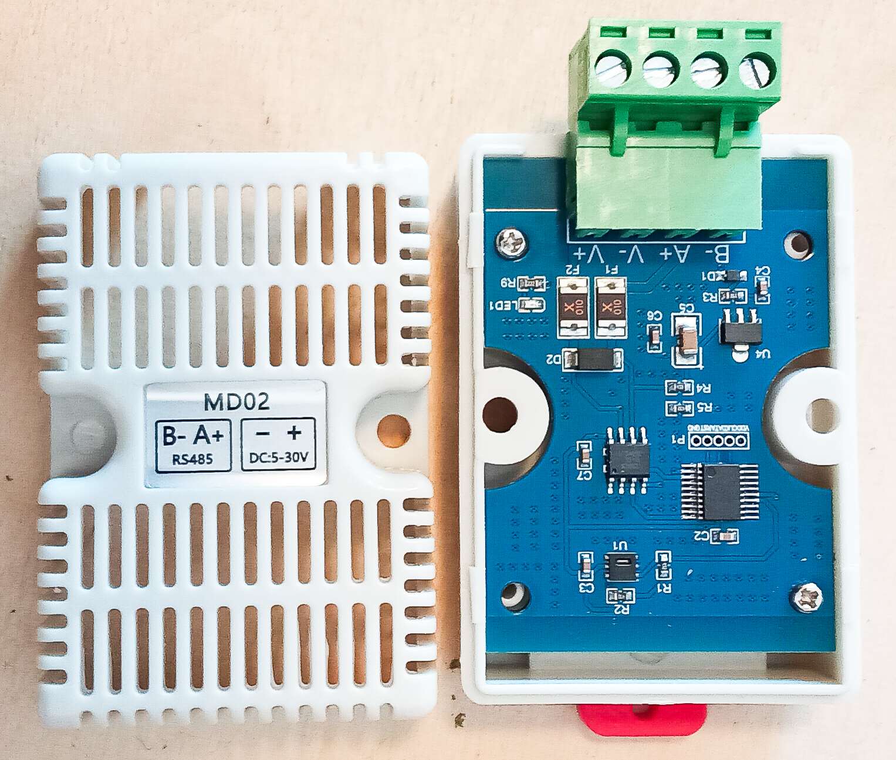

# Get Modbus RS485 data with Python
With this python scrypt here you can receive data from temperature & humidity sensors like SHT20
with MODBUS RS 485 transponder: 
##### Supported
- XY-MD01
- MD02
- XY-MD02

... more coming soon. Or open [issues](https://github.com/Nordmanngrowtechnology/Modbus-RTU_SHT-20-MD02-Test/issues)

Here you can run this python script
`python sensor.py` before it use read the documentation.

# Temperature & Humidity sensor YX-MD02 or MD02
If you have a sensor models like MD02 or clones you are right here to get information
to handle a MODBUS RS 485 connection to it.

I have compiled information that may help you if you are 
experiencing connection problems.

# The problem with the differences
If this is your first time working with this sensor, you might encounter problems. 
This is because the documentation is missing, incomplete, or incorrect, 
as the XY-MD02 and MD02 sensors are somewhat different.

## Difference between sensor MD02 and XY-MD02
There are hardware differences as well as software 
differences between the available models.

If you are very interested in the differences, 
I recommend looking at this file. [devices.py](devices.py) (Register difference)

## In most case defaults
There are many, many sensors with the same name but different values. Often, the data provided is inaccurate.
- Voltage 24V DC
- Baudrate 9600
- Device address 1
- Power consume 0.1 Ampere
- Bus resistor 120kOhm (Many devices the last get 0.5W)

##### Hardware difference *many other types exist with same name
| Product Model | Voltage  | Built-in sensor model | Advantage                                                    | PCB Raster   | Onboard-LED | Performence  | Doc                                                        |
|---------------|----------|-----------------------|--------------------------------------------------------------|--------------|-------------|--------------|------------------------------------------------------------|
| XY-MD01       | 4~30V DC |                       |                                                              |              |             |              | [XY-MD01-manual.pdf](datasheets/XY-MD01-manual.pdf)        |
| MD02          | 5~30V DC |                       |                                                              | smaller 2,54 | Yes RED     | A bit slower | [MD02-manual.pdf](datasheets/MD02-manual.pdf)              |
| XY-MD02       | 5~30V DC |                       | The larger grid makes it easier to perform a factory reset.  | 2,54         | No          |              | [XY-MD02-manual.pdf](datasheets/XY-MD02-manual.pdf)        |
| SHT30-ASIAN   | 5~28V DC |                       |                                                              |              | Yes Blue    |              |                                                            |
| EID041-G01    | 5~36V DC | AHT20                 |                                                              |              | Yes Green   |              | [EID041-G01-manual.pdf](datasheets/EID041-G01-manual.pdf)  |
| EID041-G01S   | 5~36V DC | SHT30                 |                                                              |              | Yes Green   |              | [EID041-G01-manual.pdf](datasheets/EID041-G01-manual.pdf)  |


Shown below in table difference in selectable baudrate

##### Register difference
| Modellable | Description            | Register (decimal) | Function code (hex) | Supported baudrate (default both 9600) |   |
|------------|------------------------|--------------------|---------------------|----------------------------------------|---|
| MD02       | set baudrate           | 257                | 0x06                | 2400, 4800, 9600                       |   |
| MD02       | set new device address | 256                | 0x06                |                                        |   |
| XY-MD02    | set baudrate           | 258                | 0x06                | 9600, 14400, 19200                     |   |
| XY-MD02    | set new device address | 257                | 0x06                |                                        |   |

- XY-MD02 the values came as flot
- MD02 the values came no flot and must divided by 100

If the return value of humidity and temperature divide by 100 correct
and had the sensor a red LED onboard so is it in most case MD02 version.

# HELP ERRORS & PROBLEMS

A connection can only work if the requested device address and baud rate are correct. 
A proper power supply and correct cabling are essential.

### Manufacturing defect, incorrect labeling
In some cases sensors came to me, I had ordered the labeling on
case was incorrect after opening the device see on the pcb board
the correct connection. This leads to incorrect wiring and malfunction.


The photo here shows an MD02 sensor with an incorrect label. The PCB shows how it should be labeled correctly.



The best thing to do is to peel off the label and turn it so that it's correct if it's wrong.

### The last straw: Hardware reset of MD02 and XY-MD02
It's important to know that a hardware reset is possible. If you've accidentally written incorrect 
values to registers and can no longer establish a connection, 
a hardware reset can help.

#### Hardware reset works:
Turn power of and disconnected the device from power. Open the case and bridge the pin GND to RST 
turn the power on and wait 20 seconds so device rewrite the factory defaults to the register.

This can be quite difficult as some models have a 1.27 mm PCB grid.

# Test setup

---

```
My test setup with which I tested these scripts. I also used different sensors and 
observed these differences. If you have any further information, please send me an issue.
```

# Required 

- PC
- Modbus RS 485 serial to USB
- Sensor XY-MD02, MD02 and clones
- Voltage DC 12V
- Dupont wiring

# Install
Install python and add python extension  **MinimalModbus**

`pip install -U minimalmodbus`

Clone project via git or download project files

`git clone https://github.com/Nordmanngrowtechnology/Modbus-RTU_SHT-20-MD02-Test.git`


## Usage of python script

Open command line tool and navigate to project folder example:

```
>> C:\Users> cd C:\PyCharmMiscProject\Modbus-RTU_SHT-20-MD02-Test

>>> C:\PyCharmMiscProject\Modbus-RTU_SHT-20-MD02-Test>
```
Change the connection port in script ([sensor.py](sensor.py))


With this script you can test every thing:

`python sensor.py`

Follow the instruction on screen and select the self-described function.


###### Keep in mind (XY-MD02 or MD02, clones)
- There can use **UART** with Windows direct with a c++ script ;-)


### Function register specification MODBUS RS 485

| Modbus code int |                              |
|-----------------|------------------------------|
| 0x03            | Read keep register           |
| 0x04            | Read input register          |
| 0x06            | Write a single keep register |
| 0x10            | Write more keep register     |


## Example: Function as hex XY-MD02

| Function                 | Device address | Modbus code | Register | Register |    |    |    |    |
|--------------------------|----------------|-------------|----------|----------|----|----|----|----|
| Set new baudrate 9600    | 01             | 06          | 01       | 01       | 00 | 02 | 58 | 37 |
| Get baudrate from device | 01             | 03          | 01       | 02       | 00 | 01 | 24 | 36 |
| Get device address       | 01             | 03          | 01       | 01       | 00 | 01 | D4 | 36 |
| Get temerture correction | 01             | 03          | 01       | 03       | 00 | 01 | 75 | F6 |
| Get humidity correction  | 01             | 03          | 01       | 04       | 00 | 01 | C4 | 37 |

### Documentation

The original documentation of the python extension: **MinimalModbus**

https://minimalmodbus.readthedocs.io/en/stable/usage.html#typical-usage

Sensor datasheet:
[MD02-manual.pdf](datasheets/MD02-manual.pdf)

[xy-md02-manual.pdf](datasheets/XY-MD02-manual.pdf)


# Additional information
Attention misconfiguration can lose the connection permanently.

The use of multiple sensors on a single bus line. The sensors must have the same baud rate. 
The voltage must be sufficient, and the shielding is only connected once.

1. Configure the sensors using the script to use the same baud rate 
2. and assign the individual addresses 1, 2, 3...

### Examples
[ChangeAddress.py](examples/ChangeAddress.py)

[ChangeBaudrate.py](examples/ChangeBaudrate.py)

#### Hardware info
- MCU: N76e003at20 handle the software
- SP3485 Half-Duplex RS-485 Transceivers

# TODO
- [ ] Add wiring png
- [ ] Add single bus wiring 4 x sensor and write python script
- [ ] Add address change function
- [x] ~~Add baudrate change function~~
- [ ] Add function read keep register 0x03 address 0x0102 read baudrate
- [ ] Add function read keep register 0x03 address 0x0101 read device address with device id 0x00 ???
- [ ] Add option for set baud
- [ ] Add option for set device id
- [ ] Add more devices EID041, ASIA