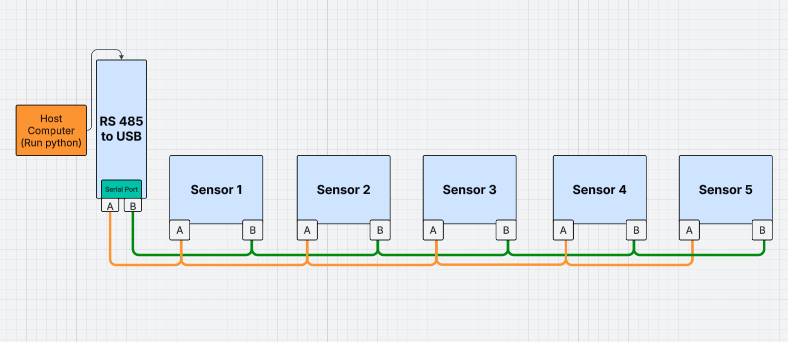

# Read data with Modbus-RTU 485
### Modbus-RTU 485 T
Temp & Humidity sensor MD02

## Difference between sensor MD02 and XY-MD02

| Model   | Voltage    | Raster       | Onboard-LED | Advantage                                                    | Performence  |
|---------|------------|--------------|-------------|--------------------------------------------------------------|--------------|
| MD02    | DC 5-30V   | smaller 2,54 | Yes RED     |                                                              | A bit slower |
| XY-MD02 | DC 5-30V   | 2,54         | No          | The larger grid makes it easier to perform a factory reset.  |              |


### Register difference
- XY-MD02 the values came as flot
- MD02 the values came no flot and must divided by 10

--- remove
SERIAL_8N1 - 8 data bits, no parity, 1 stop bit (default)
SERIAL_8N2 - 8 data bits, no parity, 2 stop bit
SERIAL_8E1 - 8 data bits, even parity, 1 stop bit


# Required 

- PC
- Modbus 485 serial to USB
- Sensor XY-MD02
- Voltage DC 5V - 28V for scenarios with long range
- Wiring

# Install
Install python and add python extension  **MinimalModbus**

`pip install -U minimalmodbus`

Clone project via git or download project files

`git clone https://github.com/Nordmanngrowtechnology/Modbus-RTU_SHT-20-MD02-Test.git`


# Usage

Open command line tool and navigate to project folder example:

```
>> C:\Users> cd C:\PyCharmMiscProject\Modbus-RTU_SHT-20-MD02-Test

>>> C:\PyCharmMiscProject\Modbus-RTU_SHT-20-MD02-Test>
```
Change the connection port in script ([temp.py](temp.py), [humidity.py](humidity.py), [both.py](both.py))
to your experiment.

Run the files you want with python in command line terminal example temperature:

`python temp.py`

```
> C:\PyCharmMiscProject\Modbus-RTU_SHT-20-MD02-Test>python temp.py

MinimalModbus debug mode. Create serial port COM6
MinimalModbus debug mode. Will write to instrument (expecting 7 bytes back): 01 04 00 01 00 01 60 0A (8 bytes)
MinimalModbus debug mode. Clearing serial buffers for port COM6
MinimalModbus debug mode. No sleep required before write. Time since previous read: 556020781.36 ms, minimum silent period: 4.01 ms.
MinimalModbus debug mode. Response from instrument: 01 04 02 01 07 F9 62 (7 bytes), roundtrip time: 0.2 ms. Timeout for reading: 200.0 ms.

Temparatur: 26.3 °C

```

# In IDE use this running by clicking

`python temp.py`

`python humidity.py`

`python both.py`


### Keep in mind XY-MD02 or MD02
- There can use **UART** with Windows direct with a c++ script

# Modbus register map

| Model |                        | Register | Function code |
|-------|------------------------|----------|---------------|
| MD02  | set baudrate           | 257      | 6             |
| MD02  | set new device address | 256      | 6             |


# Response code
 
#### Change slave baudrate to 9600

|    | Function |    |    |    | New Baudrate |    |    |
|----|----------|----|----|----|--------------|----|----|
| 01 | 06       | 01 | 01 | 00 | 02           | 58 | 37 |


### Documentation

The original documentation of the python extension: **MinimalModbus**

https://minimalmodbus.readthedocs.io/en/stable/usage.html#typical-usage

Sensor datasheet:
[xy-md02-manual.pdf](xy-md02-manual.pdf)

[Better-documentation.pdf](Better-documentation.pdf)

# Example 2

#### Connection schemata for 5 sensors in Modbus-RTU RS 485 system


Create with https://lucid.app/lucidchart/ 'i become no money for that 🙄' every sensor 
have their own power connection with 12V.

First change the device address `python ChangeAddress.py` connect one by one device
and change the number.

`python ChangeAddress.py`

# HELP ERRORS & PROBLEMS

#### No connection no receive data from device
In some cases came sensors to me, I had ordered the labeling on
case was incorrect after opening the device see on the pcb board
the correct connection.


Remove the label and turn around.

# Hardware reset of MD02
Open the case and bridge the bin GND+RST tron power on and wait 20 seconds
for restoring the factory defaults.

# TODO
- [ ] Add fritzing wiring png
- [ ] Add single bus wiring 4 x sensor and write python script